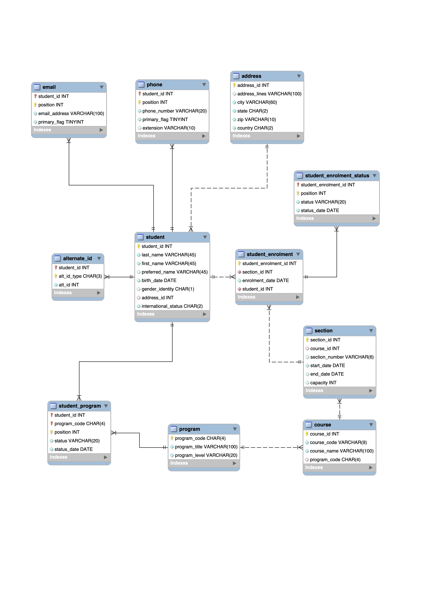
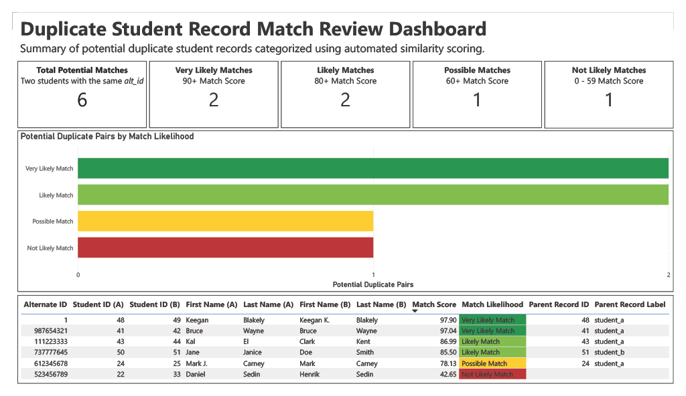

# Duplicate Record Matching Portfolio Project

**Author:** Keegan Blakely  
**Date:** 2026-03-22  

---

## 🔍 Problem
Organizations often store duplicate records due to inconsistent data entry (e.g., casing differences, formatting issues, missing values).  
This leads to inaccurate reporting, operational inefficiencies, and poor data quality.

---

## 💡 Solution
This project builds an end-to-end pipeline to identify and score potential duplicate student records using:
- SQL-based data standardization
- Python-based matching and scoring logic
- Visualization of match results

---

## 🧠 Key Features
- End-to-end workflow: **database → staging → matching → visualization**
- Handles **messy, real-world data** (inconsistent casing, formatting, duplicates)
- Weighted scoring system across multiple attributes
- Fuzzy matching for names and addresses
- Gender mismatch penalty for improved accuracy
- Parent record selection based on enrolment history

---

## 🗄️ Database Design
- Designed a relational student database from scratch using an ER diagram
- Implemented in MySQL with constraints and normalized structure

 

  

 

- Includes 11 tables (students, emails, phones, enrolments, etc.)
- Populated with synthetic data, including:
  - Intentional duplicates
  - False positives
  - Inconsistent formatting

---

## ⚙️ Pipeline & Matching Logic
- SQL staging layer standardizes raw data (names, addresses, emails, phone numbers)
- Candidate pairs generated using shared alternate IDs
- Match scoring based on:
  - Names (including preferred names, fuzzy matching)
  - Birth dates
  - Address components (line, city, state, zip, country)
  - Emails and phone numbers
  - Gender identity (penalty applied for mismatch)

### Composite Scoring
- Weighted scoring model combining all attributes
- Final classification:
  - **Very Likely Match**
  - **Likely Match**
  - **Possible Match**
  - **Not Likely Match**

### Parent Record Selection
- Record with higher enrolment count is selected
- Tie-breaker: earliest enrolment date

---

## 📊 Results & Visualization
- Identifies and ranks potential duplicate record pairs  
- Outputs a final scored dataset with match likelihood categories  

 

  

 

- Includes a Power BI dashboard with:
  - Match distribution by likelihood
  - Summary metrics
  - Highlighted final output table

---

## 🛠️ Tools & Technologies
- **MySQL** – database design, data pipeline, staging
- **Python** – data extraction and scoring logic
- **Pandas** – data manipulation
- **FuzzyWuzzy** – string similarity matching
- **Power BI** – visualization and dashboarding

---

## ▶️ How to Run
1. Import the provided SQL dump to create and populate the database
2. Update MySQL connection settings in the Jupyter notebook
3. (Optional) Adjust scoring weights and thresholds
4. Run the notebook to generate match scores and final output

---
